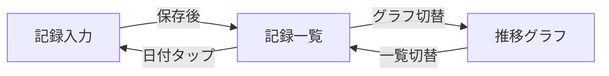
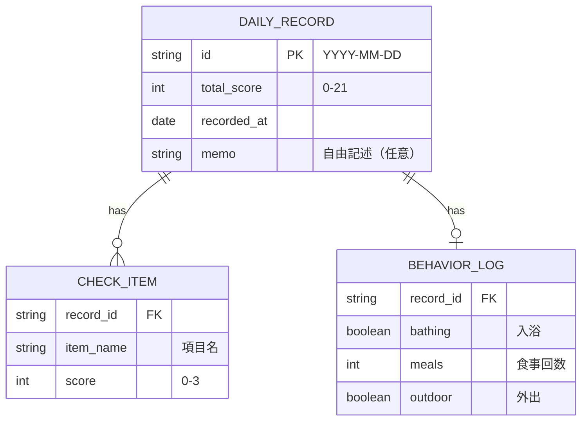
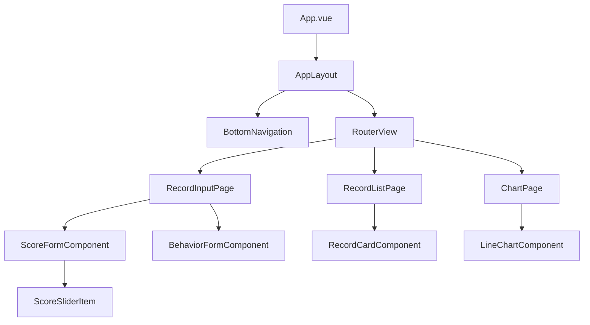

# 設計ドキュメント
 
## 1. 画面構成
 
<!-- アプリの画面一覧と遷移を整理する。
     最初は粗くてよい。実装しながら更新する。 -->
 
### 画面一覧
 
| 画面ID | 画面名 | 概要 |
|--------|--------|------|
| S-01 | 記録入力 | 当日の体調スコア・行動記録を入力する |
| S-02 | 記録一覧 | 過去の記録を日付降順で表示する |
| S-03 | 推移グラフ | 体調スコアの推移を折れ線グラフで表示する |
 
### 画面遷移図
 

 
## 2. データモデル
 
<!-- アプリが扱うデータの構造を定義する。
     テーブル設計というより「どんなデータをどう持つか」の整理。 -->
 
### ER図
 

 
### データ型定義（TypeScript）
 
```typescript
// 参考：実装時の型定義イメージ
// 設計段階では厳密でなくてよい。構造が伝わることが目的。
 
interface DailyRecord {
  id: string;             // "YYYY-MM-DD"
  totalScore: number;     // 0-21
  items: CheckItem[];
  behavior?: BehaviorLog;
  memo?: string;
  recordedAt: Date;
}
 
interface CheckItem {
  name: string;
  score: number;          // 0-3
}
 
interface BehaviorLog {
  bathing: boolean;
  meals: number;
  outdoor: boolean;
}
```
 
## 3. コンポーネント構成
 
<!-- UIコンポーネントの親子関係を整理する。
     全コンポーネントを網羅しなくてよい。主要な構成が分かればOK。 -->
 

 
## 4. 技術スタック
 
<!-- 使用する技術とバージョンを明記する。
     選定理由は各ADRに記載。ここは一覧としての参照用。 -->
 
| カテゴリ | 技術 | 備考 |
|----------|------|------|
| フレームワーク | Vue 3 (Composition API) | |
| 言語 | TypeScript | |
| 状態管理 | Pinia | → ADR-001 |
| ルーティング | Vue Router 4 | |
| グラフ描画 | （要選定） | → ADR-002で検討予定 |
| データ保存 | （要選定） | → ADR-003で検討予定 |
| スタイリング | （要選定） | → ADR-004で検討予定 |
| ビルドツール | Vite | |
 
## 5. API設計（該当する場合）
 
<!-- 外部APIを使う場合やバックエンドを持つ場合に記載する。
     今回は個人利用でローカル保存の場合は省略可。
     気象API連携がスコープに入るなら記載する。 -->
 
### 気象データ取得（US-04対応・将来実装）
 
```
GET /api/weather?date=YYYY-MM-DD&location=yokkaichi
 
Response:
{
  "date": "2026-07-17",
  "temperature": 28.5,
  "humidity": 72,
  "pressure": 1008.3,
  "weather": "曇り"
}
```
 
※ 実際には外部気象API（Open-Meteoなど）をラップする形を想定