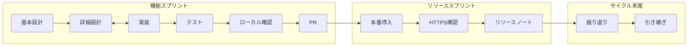

# プロジェクトドキュメント構成

このディレクトリには、設計判断のプロセスと根拠を記録するためのドキュメントを格納する。

## 構成

```
docs/
├── README.md                     # このファイル
├── requirements.md               # 課題定義・ユーザーストーリー
├── design.md                     # 画面設計・データモデル設計（Mermaid図含む）
├── conventions.md                # 人向けコーディング規約（一部確定）
├── releases/                     # リリースノート（機能・再デプロイごと）
└── adr/                          # Architecture Decision Records
    ├── 000-template.md           # ADRテンプレート
    ├── 001-state-management.md   # 状態管理ライブラリの選定
    ├── 002-package-manager.md           # パッケージマネージャーの選定
    ├── 003-development-environment.md   # 開発環境の選定
    ├── 004-node-version-management.md   # Node.js のバージョン管理
    ├── 005-ai-coding-assistant.md       # AI開発支援ツールの選定
    ├── 006-data-persistence.md          # データの保存と持ち出し
    ├── 007-styling.md                   # スタイリング手段の選定
    ├── 008-lint-format.md               # コード規約（Lint とフォーマット）
    ├── 009-testing.md                   # 単体テストと総合テスト
    ├── 010-ci.md                        # PR での自動チェック（CI）
    └── 011-hosting.md                   # 本番の公開先（ホスティング）
```

## スプリントの進め方

イテレーションとスプリントは同じ単位とする。ユーザーストーリー（US）単位で区切る。

**機能スプリント**と**リリーススプリント**に分ける。7段階（基本設計〜振り返り）は共通の語彙として両方に割り当てる。詳細設計と実装は**往復可**（一直線だけではない）。



### 機能スプリント

| 段階     | やること                               | 置き場                                                                                                                                                     |
| -------- | -------------------------------------- | ---------------------------------------------------------------------------------------------------------------------------------------------------------- |
| 基本設計 | 誰の何を解くか、成功条件、やらないこと | [requirements.md](./requirements.md) の対象 US                                                                                                             |
| 詳細設計 | 画面・データ・コピー文面・技術判断     | [design.md](./design.md)、[ADR](./adr/)、必要なら [conventions.md](./conventions.md)                                                                       |
| 実装     | スコープどおりのコード                 | `src/` と設定                                                                                                                                              |
| テスト   | 壊れていないことを機械で見る           | `type-check`、lint / format、Vitest の単体（[ADR-009](./adr/009-testing.md)）。PR では同じコマンドを GitHub Actions でも回す（[ADR-010](./adr/010-ci.md)） |
| 確認     | **ローカル or dev** で受け入れ         | 入力・コピーなど US の成功条件                                                                                                                             |
| PR       | 実装〜ローカル確認後に出す             | 1 US = 1 ブランチ = 1 PR。CI `check` が通るまで直す。通過後にコメントと Approve を依頼し、揃ってから merge（[pr-merge](../.cursor/rules/pr-merge.mdc)） |

PR の直後に、計画ファイルへ**日付付きの短いメモ**（数行）を残してよい。本振り返りの代わりにはしない。

実装中に判断が出たら、先に ADR / `design.md` を更新してからコードを続ける。

### リリーススプリント

| 段階             | やること                                                               | 置き場                                                                                                         |
| ---------------- | ---------------------------------------------------------------------- | -------------------------------------------------------------------------------------------------------------- |
| 本番環境への導入 | 利用者が触る HTTPS の公開面へ出す                                      | GitHub Pages（[ADR-011](./adr/011-hosting.md)）                                                                |
| 確認（総合）     | 本番 URL で受け入れ条件を人が満たすか見る。結果はその回のノートに残す  | コピー権限など、localhost と挙動が違うもの。[ADR-009](./adr/009-testing.md)。置き場は [releases/](./releases/) |
| リリースノート   | 何が変わったかを短く残す。GitHub Releases からそのファイルへリンクする | [releases/](./releases/)                                                                                       |

**確認の定義:** Preview URL だけでは足りない。利用者が使う本番 URL で総合テストする。結果は [releases/](./releases/) のその回のノートに残す。

一周目は**初回リリーススプリント**として独立してよい（ホスト接続・HTTPS 総合・ノート・GitHub Release）。2周目以降は、機能 PR の merge 後に**短い再デプロイ**で足りる。公開面が更新されたら、触った操作だけ本番 URL で確認し、ノートを短く書く。

ホスト・セキュリティヘッダー・ビルド設定など、導入まわりを触ったリリースはノートに明記し、確認を厚くする。

公開後の不具合は修正して短い再デプロイとし、ノートに残す（パッチ）。

### セキュリティ（一周目）

アプリは記録を永続化しない（ADR-006）。ブラウザを閉じれば入力は消える。CORS や API 認証は、外部へ保存するまで対象外である。

残る関心は主に GitHub（公開リポジトリに秘密を置かない）とホスティング（GitHub Pages の HTTPS。ヘッダーは [ADR-011](./adr/011-hosting.md)）である。設定を足すときは、その画面の意味を説明してから書く。

### サイクル末尾（機能＋リリースのあと）

**リリースノートの後**に、1回の振り返りを行う。個人プロジェクトでは、次 US に効く話を整理し、**引き継ぎプロンプト**を書いて新しいチャットで次のサイクルを始める。

振り返りの見出しは次の3つに固定する。

```markdown
## 機能

（US・UX・設計でうまくいったこと / 持ち越し）

## リリース

（導入・HTTPS 確認・設定変更。触っていなければ「変更なし・再デプロイのみ」）

## 次 US

（次に解く US、未決、docs で正とする節）
```

引き継ぎプロンプトは、対象 US の**計画ファイル末尾**に日付付きで残す。恒久の判断は `docs/` が正。引き継ぎは新チャット起動用。

### 完了の定義

| 名称         | 条件                                                                                  |
| ------------ | ------------------------------------------------------------------------------------- |
| 機能完了     | ローカル確認まで終わり、PR を merge した（単体は ADR-009 のとおり Vitest を含む）     |
| リリース完了 | 本番 URL で総合確認し、[releases/](./releases/) を書き、GitHub Release からリンクした |
| サイクル完了 | 振り返り（3見出し）と引き継ぎプロンプトまで終え、次 US を開始できる                   |

### 置き場（確定）

- **変更履歴の正**: [docs/releases/](./releases/)（ルートの `CHANGELOG.md` は作らない）
- **GitHub Releases**: 出すたびに1件。本文は短い要約と、上の Markdown へのリンク。アプリ内や X への埋め込みは置かない
- **引き継ぎプロンプト**: 対象 US の Cursor 計画ファイル（`US-xx-NN_*.plan.md`）の末尾に日付付きで残す
- **規約の正**: コードは [conventions.md](./conventions.md)。PR の merge は [`.cursor/rules/pr-merge.mdc`](../.cursor/rules/pr-merge.mdc)

## ドキュメントの書き進め方

機能スプリントの基本設計・詳細設計で、次を行う。

1. **requirements.md** に、その US で解く「誰の・何の問題を・なぜ解くか」を書く
2. 技術的な判断が必要になるたびに **ADR** を1件書く
3. 実装に入る前に **design.md** で画面とデータ構造を整理する
4. 同じタイミングで、そのスコープの目的と「やらないこと」を短く固定する
5. 判断が変わった場合は、古いADRのステータスを `superseded by ADR-XXX` に変更し、新しいADRを起こす

## ADRのステータス

| ステータス              | 意味                               |
| ----------------------- | ---------------------------------- |
| `proposed`              | 提案中。まだ確定していない         |
| `accepted`              | 採用。この判断で進める             |
| `deprecated`            | 非推奨。この判断はもう有効ではない |
| `superseded by ADR-XXX` | 別のADRに置き換えられた            |

## 運用方針

- 完璧を目指さない。「その時点での判断」を記録することが目的
- 判断が後から変わることは想定内。変更の経緯が追跡できることに価値がある
- ドキュメントは実装中の判断でも更新する。製品全体を書き上げてから実装に入る、という進め方はしない
- 機能スプリントとリリーススプリントを分け、サイクル末尾で振り返りと引き継ぎを行う
- 先のストーリー用に ADR 番号を予約しない。必要になった時点の次番号を使う
