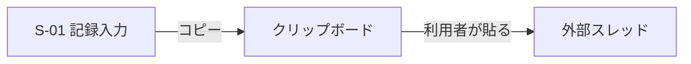
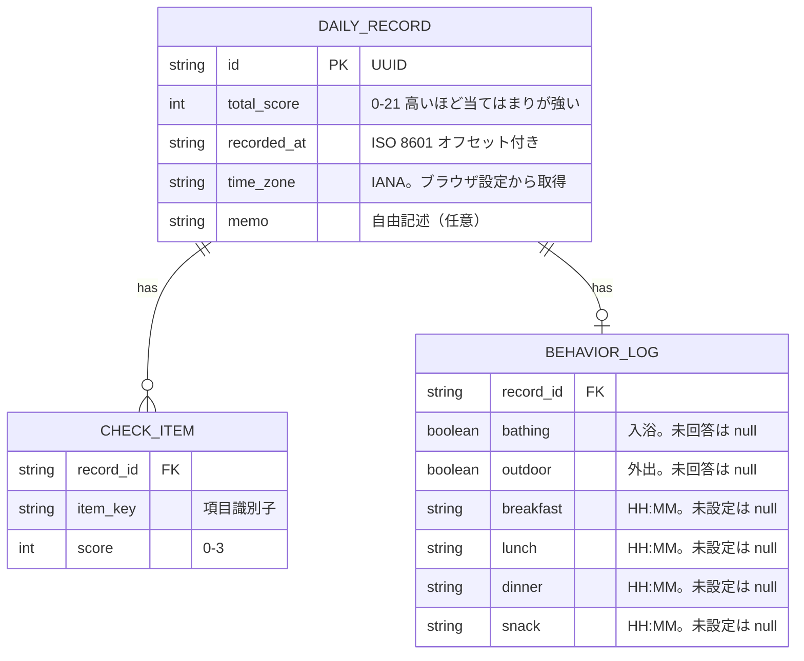
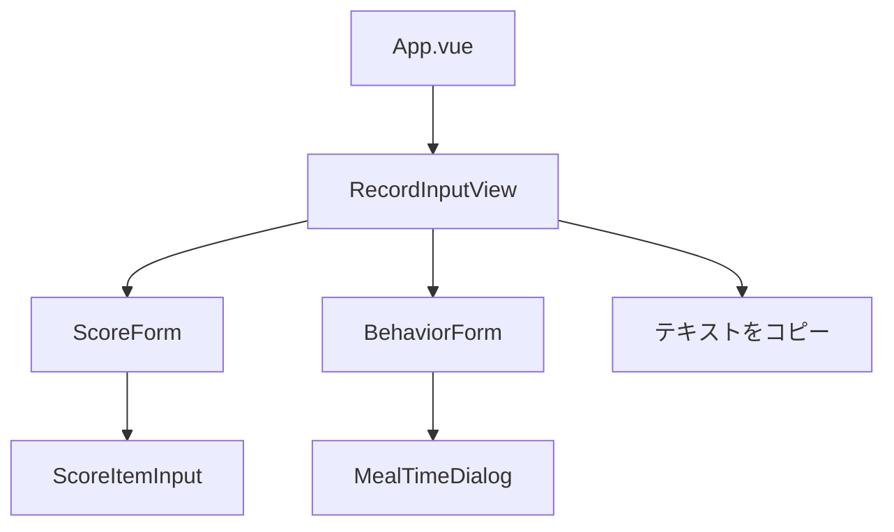
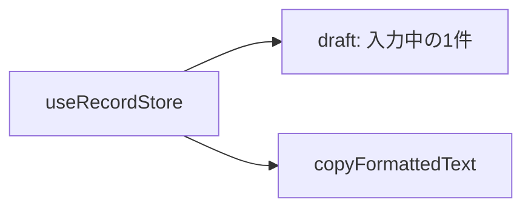

# 設計ドキュメント

## 1. 画面構成

### 画面一覧

| 画面ID | 画面名     | 対応ストーリー             | 概要                                                             |
| ------ | ---------- | -------------------------- | ---------------------------------------------------------------- |
| S-01   | 記録入力   | US-01, US-03（将来 US-05） | 体調スコアと行動記録を入力し、整形テキストをコピーする           |
| S-02   | 記録一覧   | US-02                      | 過去の記録を日付降順で表示する（保存の正をアプリ側に置いてから） |
| S-03   | 推移グラフ | US-04                      | 体調スコアの推移を折れ線グラフで表示する（同上）                 |

### 画面遷移図

一周目は S-01 のみ。コピーしたあとの遷移先はアプリ内にない（外部スレッドへ貼る）。



S-02 / S-03 は保存手段の再検討（US-02）のあとに接続する。空のプレースホルダルートも、そのときに入れる。

## 2. データモデル

### ER図



### 型定義（TypeScript）

```typescript
interface DailyRecord {
  id: string // UUID
  totalScore: number // 0-21 高いほど質問への当てはまりが強い
  items: CheckItem[]
  behavior?: BehaviorLog
  memo?: string
  recordedAt: string // ISO 8601（オフセット付き）
  timeZone: string // IANA。ブラウザの設定から取得
}

interface CheckItem {
  key: string
  score: number // 0-3（0=なし、3=とても）
}

interface BehaviorLog {
  bathing: boolean | null
  outdoor: boolean | null
  meals: {
    breakfast: string | null // HH:MM
    lunch: string | null
    dinner: string | null
    snack: string | null
  }
}
```

### 項目定義と行動記録の持ち方

チェック項目の表示名と質問文は、記録の1件ごとには持たない。
定義はアプリ全体で1か所に置き、各記録の `items` は `{ key, score }` だけにする。
`key` は定義表の `id` と一致させる。

点数は質問文への当てはまりである。0はなし、3はとても当てはまる。
合計（0〜21）が高いほど、自覚している負担が強い。
このチェックリストは自己モニタリング用であり、診断や医療的判定を目的としない。

```typescript
const checkItemDefinitions = [
  { id: 'q1', label: '気分・憂うつ', text: '気分が落ち込む・憂うつに感じた' },
  { id: 'q2', label: '興味・喜びの減退', text: '物事への興味や喜びが感じられなかった' },
  { id: 'q3', label: '疲労・気力', text: '疲れやすい・気力がなかった' },
  { id: 'q4', label: '睡眠', text: '睡眠に問題があった(入眠困難・中途覚醒・過眠など)' },
  { id: 'q5', label: '食欲の変化', text: '食欲の変化があった(低下または増加)' },
  { id: 'q6', label: '自己否定', text: '自分を責める気持ち・無価値感があった' },
  { id: 'q7', label: '集中力', text: '集中することが難しかった' },
]
```

実装時はこの定義をソース上の定数として置く。英語名は今は持たない。必要になったら定義表に足す。

入力の4択ラベルは現行ツールに合わせる。数字と日本語を併記する。絵文字は使わない。

```typescript
const scaleLabels = [
  { value: 0, label: 'なし' },
  { value: 1, label: '少し' },
  { value: 2, label: 'かなり' },
  { value: 3, label: 'とても' },
]
```

画面では `text` を質問文として出し、`label` は一覧など短い表示用にする。
未回答は 0 点と区別する（`null`）。未回答を 0 として足さない。
合計の数値は全問回答後にだけ出す。未回答が残る間は合計も文面も `—` で示す。
コピーは未回答があってもいつでもできる。ボタン文言は「テキストをコピー」。

US-01 の入力UI（現行ツールから採用するもの）:

- 各項目は 4 列の大きいボタン。上に数値、下にラベル
- 画面下にコピー文面のライブプレビューを置く。初期は全項目 `—/3`・合計 `—/21`。選択のたびに更新する
- テーマは ADR-007。色は D3 オリーブ茶。切替は F（OS 既定、タブ内上書き、localStorage なし）。`useRecordStore` には置かない
- 出力はクリップボードへのコピーである（ADR-006）。アプリ内には履歴を残さない。プレビューはテキスト補間であり、`v-html` は使わない

現行ツールにあって、US-03 でも持たないもの:

- 活動の開始・終了・内容の行追加（時間幅の将来タスク）
- 「今日のこと」「相談・共有」の 2 メモ（US-05。相談欄は現行にあり、汎用 `memo` と分けるかは当時決める）
- 合計の帯ラベル（低 / 軽度 / 中等度 / 要注意）。診断に読まれやすいので点数のみ
- タイムライン、空き時間、5分刻みグリッドなどの時刻ピッカーの作り込み

`behavior` の正は Pinia の draft である。画面はそれを映す。食事モーダルを開いただけの時刻は、決定するまで draft に載せない。

- `bathing` / `outdoor`: `boolean | null`。未回答はコピーで `—`
- `meals`: 朝 / 昼 / 晩 / 間食それぞれの `HH:MM | null`。未設定は `—`。回数では持たない

開始・終了の時間幅で持つ形や、「設定で bool と時間入力を切り替える」汎用化は将来タスクとする。
US-01 では `behavior` も `memo` も入力しない。US-03 で `behavior` を入力する。出力はコピーのみ（ADR-006）。localStorage には記録もテーマ選好も置かない。

1件の識別子は日付ではない。1日に複数件あってよい。暦日でのグループ化が必要な画面（一覧）は、保存の正をアプリ側に置いてから、`recordedAt` を `timeZone` で解釈した日付でまとめる。画面上の日時表示は `YYYY-MM-DD HH:mm:ss` にタイムゾーン名を添える。コピー文面の日時は現行ツールに合わせ、分までと曜日を出し、タイムゾーン名を添える（秒は `recordedAt` の ISO にだけ残す）。タイムゾーンはブラウザ／OS から取る。VPN の出口 IP からは取らない。

## 3. コンポーネント構成

一周目は入力画面だけを置く。一覧・グラフ用の空ルートは、保存の正をアプリ側に置く判断のあとに足す。



US-05 はそれより後でメモ欄を足す。Vue Router は入れない。

```
src/
├── views/
│   └── RecordInputView.vue
├── components/
│   ├── ScoreForm.vue
│   ├── ScoreItemInput.vue
│   ├── BehaviorForm.vue
│   └── MealTimeDialog.vue
└── stores/
    └── record.ts
```

`App.vue` から `RecordInputView` を出す。コピー処理はストアの `copyFormattedText` を呼ぶ。テーマ用の composable は切替 F のタブ内上書きを持つ。`useRecordStore` には置かない。

### コンポーネントとストアの責務（US-01 / US-03）

| 単位              | 責務                                                                                                                           |
| ----------------- | ------------------------------------------------------------------------------------------------------------------------------ |
| `RecordInputView` | 画面全体。スコアと行動。コピー文面のライブプレビュー、常時有効のコピーボタン                                                   |
| `ScoreForm`       | 7項目を定義表の順に並べる                                                                                                      |
| `ScoreItemInput`  | 1項目の質問文と 0〜3 の4ボタン                                                                                                 |
| `BehaviorForm`    | 入浴・外出の 2 択、食事 4 スロット。未設定の食事を開くと `MealTimeDialog`                                                      |
| `MealTimeDialog`  | 開いた時刻を初期値にする（未設定のとき）。決定だけ draft に書く。キャンセルは変えない。クリアは `null`。ネイティブの時刻入力   |
| `useRecordStore`  | 入力中の draft（スコアは `number \| null`、行動は上の型）。全問後にだけ数値合計。プレビューと `copyFormattedText` で文面を作る |

コピーした瞬間に `id`（UUID）、`recordedAt`、`timeZone` を付ける。日付の入力欄は置かない。

同一日に再度コピーした場合は、アプリ内に履歴がないので上書き対象もない。新しい整形テキストがもう1件分としてクリップボードに乗る。スレッド側で2件並ぶ。

## 4. 状態管理

Piniaのストア構成は以下を想定する（詳細は ADR-001 参照）。
永続化しない。入力中の1件と、コピー用の整形テキストだけを持つ。テーマ選好は record ストアに置かない。



`records` 配列や `getRecordsByLocalDate` は、保存の正をアプリ側に置く判断のあとに足す。

## 5. 技術スタック

| カテゴリ               | 技術                    | 選定理由                                                                 |
| ---------------------- | ----------------------- | ------------------------------------------------------------------------ |
| フレームワーク         | Vue 3 (Composition API) | 既存の実務経験                                                           |
| 言語                   | TypeScript              | 既存の実務経験                                                           |
| ビルドツール           | Vite                    | Vue 3の標準的な構成                                                      |
| 状態管理               | Pinia                   | ADR-001                                                                  |
| ルーティング           | 未導入                  | 一周目は入力画面のみ。一覧をアプリ内に置くときに Vue Router を入れる     |
| パッケージマネージャー | npm                     | ADR-002                                                                  |
| 開発環境               | 自前PCのローカル        | ADR-003                                                                  |
| Node.js                | 26.7.0（Volta）         | ADR-004                                                                  |
| AI開発支援             | Cursor                  | ADR-005                                                                  |
| データ保存・持ち出し   | クリップボードへコピー  | ADR-006                                                                  |
| スタイリング           | Tailwind CSS            | ADR-007                                                                  |
| コード規約             | ESLint + Prettier       | ADR-008                                                                  |
| 単体テスト             | Vitest                  | ADR-009                                                                  |
| CI                     | GitHub Actions          | ADR-010。PR で type-check / lint / format / 単体を回す                   |
| デプロイ先             | GitHub Pages            | ADR-011。ビルドは Actions（Node 26.7.0）。Vercel は Node 26 対応後に検討 |
| グラフ描画             | 未定                    | US-04着手時にADRを起こす。番号は予約しない                               |

## 6. 実装方針

- ユーザーストーリー単位でイテレーション（スプリント）を区切る
- **機能スプリント**（基本設計〜PR）と**リリーススプリント**（導入〜総合確認〜リリースノート）に分ける。振り返りと引き継ぎはサイクル末尾（[docs/README.md](./README.md)）
- 1 US = 1 ブランチ = 1 PR を基本とする（PR は機能スプリントの末尾）。起点は最新の `main`。`main` への直接コミットは禁止。名前と切り方は [conventions.md](./conventions.md) 第7節
- テストは薄い単体（Vitest）と本番 URL での人手の総合（ADR-009）。E2E 自動は入れない
- 2周目以降のリリースは短い再デプロイ。確認は利用者が触る本番 URL。変更履歴の正は [releases/](./releases/)。GitHub Releases からリンクする
- 実装に入る前に、そのスコープの目的（何のためか、成功なら何ができるか、やらないこと）を短く書く。目的から外れる実装は足さない
- 設計判断が発生した時点でADRを起こしてからコードを書く
- 未確定の技術選定は「未定」として明示し、必要になった時点で判断する
- 先のストーリー用に ADR 番号を予約しない。グラフは US-04 まで番号を空けない

## 7. コピー文面と、US-03 で足すもの

スコア部分の読み方は US-01 のままにする。行動を足すときはこの節が正である。実装より先に更新する。

### US-01 で実装したもの（完了。変えない）

- 7項目の定義定数と、4択（なし / 少し / かなり / とても）
- 未回答は `null`。未回答は文面で `—/3`、未完了の合計は `—/21`。コピーは常に可
- コピー文面のライブプレビュー。ボタン文言は「テキストをコピー」
- クリップボードへのコピー（ADR-006）。再読み込みで入力は消えてよい
- Pinia の draft ストア。Vue Router は入れない

### US-03 で実装するもの

- 入浴・外出（`boolean | null`）と、朝昼晩・間食の時刻（`HH:MM | null`）
- 同じライブプレビューへ `[行動]` `[食事]` を足す。プレビューはテキスト補間。`v-html` は使わない
- 食事はモーダル。未設定を開いたときは、開いた時刻を初期値にする。決定だけ draft に書く
- ダーク（ADR-007）。色は D3 オリーブ茶。切替は F。`html` への反映は composable。記録ストアには置かない

### コピー文面（US-03）

US-01 の見出し・日時・合計・`[症状]` は残す。現行ツールに合わせて、その前に `[行動]` と `[食事]` を置く。`[活動]` `[今日のこと]` `[相談・共有]` と合計横の区分は出さない。

含める:

- 見出し `【日々の気分チェック記録】`
- 日時: `YYYY-MM-DD (曜) HH:MM` に IANA タイムゾーン名
- 合計: 全問後は `X/21`。未完了は `—/21`。区分は出さない
- `[行動]`: `お風呂・シャワー: 入れた | 入れなかった | —` と `外出: できた | できなかった | —`
- `[食事]`: `朝ごはん` `昼ごはん` `夜ごはん` `間食` それぞれ `HH:MM` または `—`
- `[症状]` の7行。形式は `番号. 短いlabel: X/3`。未回答は `—/3`

食事の時刻にタイムゾーン名は添えない（見出しの日時だけ）。

例（全問回答後。行動と食事は一部未設定）:

```
【日々の気分チェック記録】
日時: 2026-08-25 (火) 13:15 Asia/Tokyo
合計: 12/21

[行動]
お風呂・シャワー: 入れた
外出: —

[食事]
朝ごはん: 08:30
昼ごはん: —
夜ごはん: 19:00
間食: —

[症状]
1. 気分・憂うつ: 2/3
2. 興味・喜びの減退: 1/3
3. 疲労・気力: 2/3
4. 睡眠: 3/3
5. 食欲の変化: 1/3
6. 自己否定: 2/3
7. 集中力: 1/3
```

例（初期表示。スコアも行動も未回答）:

```
【日々の気分チェック記録】
日時: 2026-08-25 (火) 15:57 Asia/Tokyo
合計: —/21

[行動]
お風呂・シャワー: —
外出: —

[食事]
朝ごはん: —
昼ごはん: —
夜ごはん: —
間食: —

[症状]
1. 気分・憂うつ: —/3
2. 興味・喜びの減退: —/3
3. 疲労・気力: —/3
4. 睡眠: —/3
5. 食欲の変化: —/3
6. 自己否定: —/3
7. 集中力: —/3
```

曜日は `recordedAt` を `timeZone` で解釈した暦日の日本語略称（日〜土。現行ツールと同じ並び）とする。
時刻の分はゼロ埋めする。入力の4択ラベル（なし／少し／かなり／とても）は画面用であり、コピーとプレビューには数値または `—` だけを出す。
プレビューの日時は、スコアまたは行動が変わるたびにその時点のブラウザ時計で更新する。クリップボードへ書く日時はコピー操作の瞬間とする。

### 実装しない（US-03）

- 活動行、メモ、帯ラベル、日付ピッカー
- アプリ内の永続化、一覧、グラフ、localStorage（記録もテーマ選好も）
- `v-html`、5分刻みグリッド、タイムライン

## 8. 進め方の例（US-01 / 一周目）

手順の正は [docs/README.md](./README.md) の「スプリントの進め方」。ここは当時の位置づけの例。更新より README を優先する。

| ブロック           | US-01 の例（2026-09-09 時点）                                                                                                                                                 |
| ------------------ | ----------------------------------------------------------------------------------------------------------------------------------------------------------------------------- |
| 機能スプリント     | 完了。[PR #1](https://github.com/HaraRyonosuke/condition-tracker/pull/1) を merge（`4a95dd7`）。機能振り返り済み                                                              |
| リリーススプリント | 完了。GitHub Pages。本番 HTTPS 総合は [releases/US-01.md](./releases/US-01.md)。[GitHub Release us-01](https://github.com/HaraRyonosuke/condition-tracker/releases/tag/us-01) |
| サイクル末尾       | 完了（2026-09-09）。3見出しと引き継ぎは計画 US-01-11 / US-01-10 末尾。次は US-03（計画 US-03-01）                                                                             |
