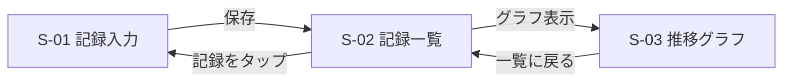
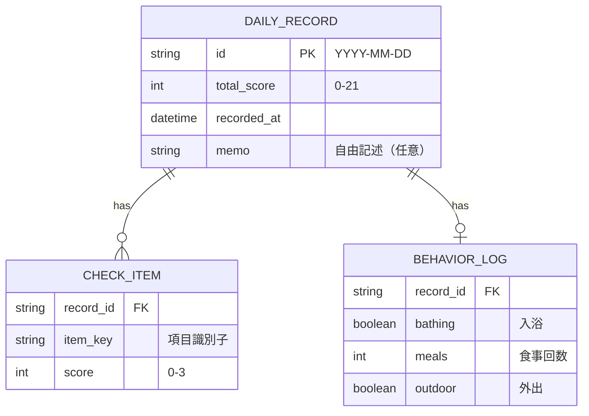
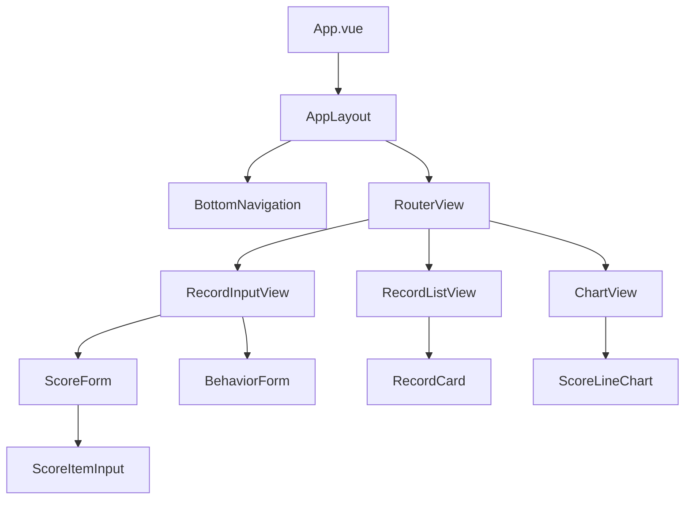
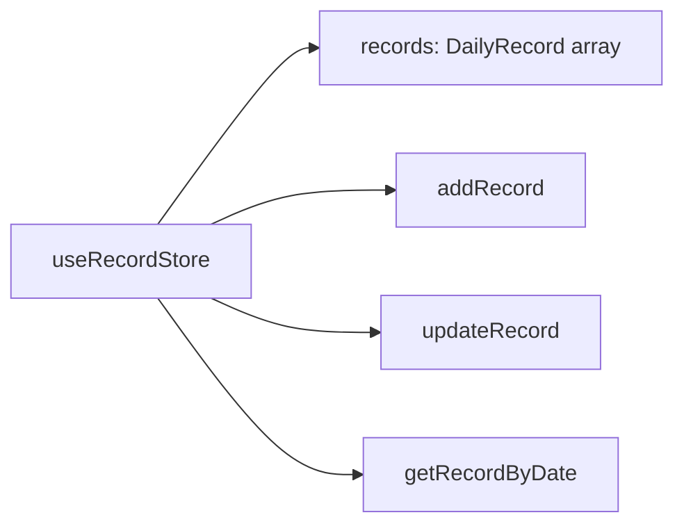

# 設計ドキュメント

## 1. 画面構成

### 画面一覧

| 画面ID | 画面名 | 対応ストーリー | 概要 |
|--------|--------|---------------|------|
| S-01 | 記録入力 | US-01, US-03, US-05 | 当日の体調スコア・行動記録を入力する |
| S-02 | 記録一覧 | US-02 | 過去の記録を日付降順で表示する |
| S-03 | 推移グラフ | US-04 | 体調スコアの推移を折れ線グラフで表示する |

### 画面遷移図



## 2. データモデル

### ER図



### 型定義（TypeScript）

```typescript
interface DailyRecord {
  id: string;             // "YYYY-MM-DD"
  totalScore: number;     // 0-21
  items: CheckItem[];
  behavior?: BehaviorLog;
  memo?: string;
  recordedAt: Date;
}

interface CheckItem {
  key: string;
  score: number;          // 0-3
}

interface BehaviorLog {
  bathing: boolean;
  meals: number;
  outdoor: boolean;
}
```

## 3. コンポーネント構成



## 4. 状態管理

Piniaのストア構成は以下を想定する（詳細は ADR-001 参照）。



## 5. 技術スタック

| カテゴリ | 技術 | 選定理由 |
|----------|------|---------|
| フレームワーク | Vue 3 (Composition API) | 既存の実務経験 |
| 言語 | TypeScript | 既存の実務経験 |
| ビルドツール | Vite | Vue 3の標準的な構成 |
| 状態管理 | Pinia | ADR-001 |
| ルーティング | Vue Router 4 | Vue公式のルーター |
| パッケージマネージャー | npm | ADR-002 |
| 開発環境 | GitHub Codespaces | ADR-003 |
| グラフ描画 | 未定 | ADR-004で検討予定（US-04対応時） |
| データ保存 | 未定 | ADR-005で検討予定 |
| スタイリング | 未定 | ADR-006で検討予定 |

## 6. 実装方針

- ユーザーストーリー単位でイテレーションを区切る
- 1イテレーション = 1ブランチ = 1プルリクエスト
- 設計判断が発生した時点でADRを起こしてからコードを書く
- 未確定の技術選定は「未定」として明示し、必要になった時点で判断する