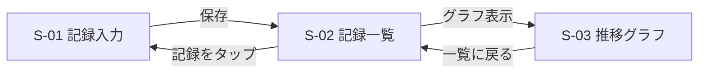
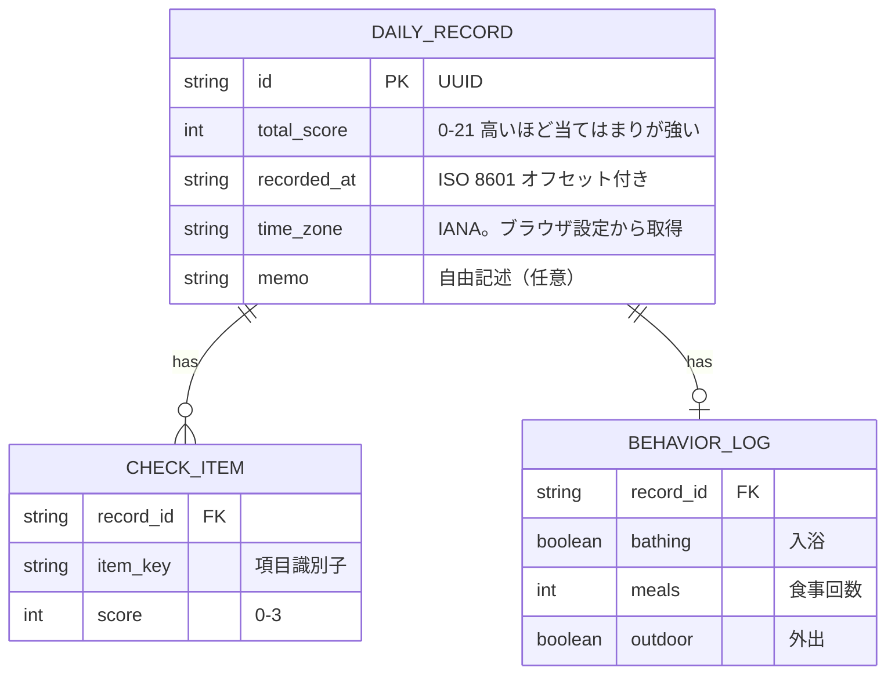
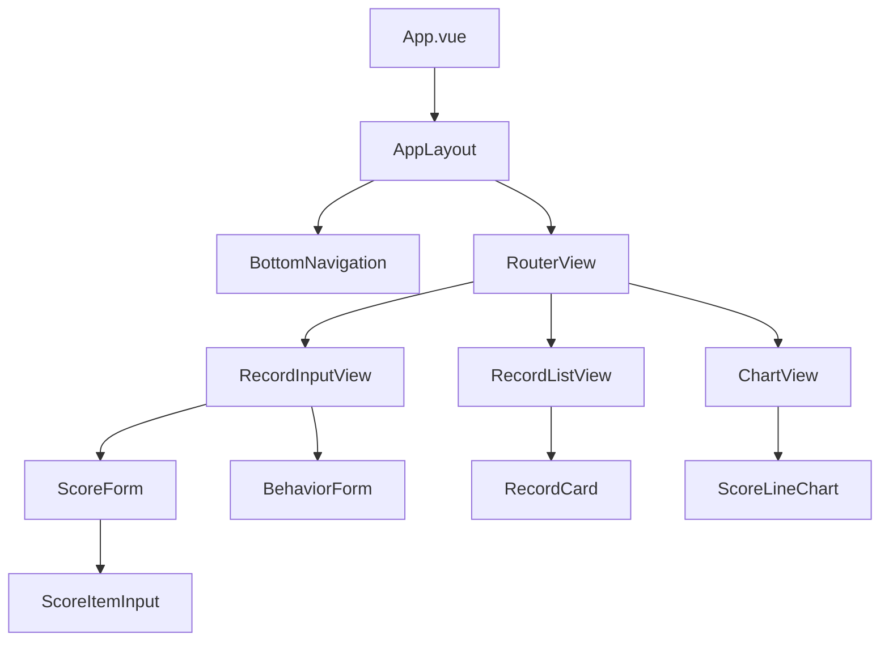
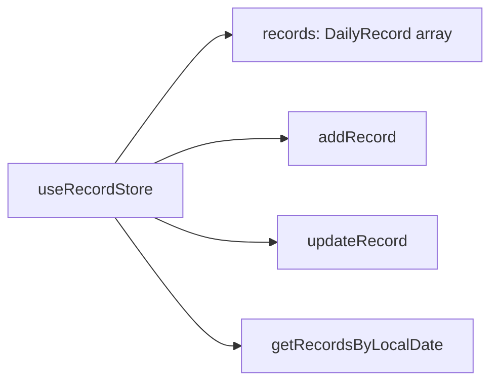

# 設計ドキュメント

## 1. 画面構成

### 画面一覧

| 画面ID | 画面名 | 対応ストーリー | 概要 |
|--------|--------|---------------|------|
| S-01 | 記録入力 | US-01, US-03, US-05 | 体調スコア・行動記録を入力する |
| S-02 | 記録一覧 | US-02 | 過去の記録を日付降順で表示する |
| S-03 | 推移グラフ | US-04 | 体調スコアの推移を折れ線グラフで表示する |

### 画面遷移図



## 2. データモデル

### ER図



### 型定義（TypeScript）

```typescript
interface DailyRecord {
  id: string;             // UUID
  totalScore: number;     // 0-21 高いほど質問への当てはまりが強い
  items: CheckItem[];
  behavior?: BehaviorLog;
  memo?: string;
  recordedAt: string;     // ISO 8601（オフセット付き）
  timeZone: string;       // IANA。ブラウザの設定から取得
}

interface CheckItem {
  key: string;
  score: number;          // 0-3（0=なし、3=とても）
}

interface BehaviorLog {
  bathing: boolean;
  meals: number;
  outdoor: boolean;
}
```

### 項目定義と行動記録の持ち方

チェック項目の表示名と質問文は、記録の1件ごとには持たない。
定義はアプリ全体で1か所に置き、各記録の `items` は `{ key, score }` だけにする。
`key` は定義表の `id` と一致させる。

点数は質問文への当てはまりである。0はなし、3はとても当てはまる。
合計（0〜21）が高いほど、自覚している負担が強い。
このチェックリストは自己モニタリング用であり、診断や医療的判定を目的としない。

```typescript
const checkItemDefinitions = [
  { id: "q1", label: "気分・憂うつ", text: "気分が落ち込む・憂うつに感じた" },
  { id: "q2", label: "興味・喜びの減退", text: "物事への興味や喜びが感じられなかった" },
  { id: "q3", label: "疲労・気力", text: "疲れやすい・気力がなかった" },
  { id: "q4", label: "睡眠", text: "睡眠に問題があった(入眠困難・中途覚醒・過眠など)" },
  { id: "q5", label: "食欲の変化", text: "食欲の変化があった(低下または増加)" },
  { id: "q6", label: "自己否定", text: "自分を責める気持ち・無価値感があった" },
  { id: "q7", label: "集中力", text: "集中することが難しかった" },
];
```

実装時はこの定義をソース上の定数として置く。英語名は今は持たない。必要になったら定義表に足す。

入力の4択ラベルは現行ツールに合わせる。数字と日本語を併記する。絵文字は使わない。

```typescript
const scaleLabels = [
  { value: 0, label: "なし" },
  { value: 1, label: "少し" },
  { value: 2, label: "かなり" },
  { value: 3, label: "とても" },
];
```

画面では `text` を質問文として出し、`label` は一覧など短い表示用にする。
未回答は 0 点と区別する（`null`）。7問すべて答えてから保存できる。
合計は全問回答後にだけ見せる。未回答を 0 として足さない。

US-01 の入力UI（現行ツールから採用するもの）:

- 各項目は 4 列の大きいボタン。上に数値、下にラベル
- ダークモードは OS の `prefers-color-scheme` に合わせる（専用テーマ選定はスタイルADR）
- クリップボードへコピーして外部スレッドへ貼る流れは、現行ツールの主出力である。アプリ内保存とどちらを正にするかは ADR-006 で比較する。US-01 実装前に決める

現行ツールにあって、このスプリントでは持たないもの:

- 入浴・外出の bool と、朝昼晩・間食の時刻（US-03。型は当面 bool と食事回数のまま。現行は食事が時刻なので、US-03 着手時に寄せ方を決める）
- 活動の開始・終了・内容の行追加（時間幅の将来タスク）
- 「今日のこと」「相談・共有」の 2 メモ（US-05。相談欄は現行にあり、汎用 `memo` と分けるかは当時決める）
- 合計の帯ラベル（低 / 軽度 / 中等度 / 要注意）。診断に読まれやすいので US-01 では点数のみ
- タイムライン、空き時間、時刻ピッカーの作り込み

`behavior` は、US-03 まで含む当面では真偽と回数のままにする。

- `bathing` / `outdoor`: bool
- `meals`: 回数（整数）

開始・終了の時間幅で持つ形や、「設定で bool と時間入力を切り替える」汎用化は将来タスクとする。
一周目の範囲を広げない。US-01 では `behavior` も `memo` も入力しない。保存の正（アプリ内かコピー出力か）は ADR-006 で決める。

1件の識別子は日付ではない。1日に複数件あってよい。暦日でのグループ化が必要な画面（一覧）は、`recordedAt` を `timeZone` で解釈した日付でまとめる。画面上の日時表示は `YYYY-MM-DD HH:mm:ss` にタイムゾーン名を添える。

## 3. コンポーネント構成



## 4. 状態管理

Piniaのストア構成は以下を想定する（詳細は ADR-001 参照）。



## 5. 技術スタック

| カテゴリ | 技術 | 選定理由 |
|----------|------|---------|
| フレームワーク | Vue 3 (Composition API) | 既存の実務経験 |
| 言語 | TypeScript | 既存の実務経験 |
| ビルドツール | Vite | Vue 3の標準的な構成 |
| 状態管理 | Pinia | ADR-001 |
| ルーティング | Vue Router 4 | Vue公式のルーター |
| パッケージマネージャー | npm | ADR-002 |
| 開発環境 | GitHub Codespaces | ADR-003 |
| グラフ描画 | 未定 | ADR-004で検討予定（US-04対応時） |
| データ保存 | 未定 | ADR-005で検討予定 |
| スタイリング | 未定 | ADR-006で検討予定 |

## 6. 実装方針

- ユーザーストーリー単位でイテレーションを区切る
- 1イテレーション = 1ブランチ = 1プルリクエスト
- 設計判断が発生した時点でADRを起こしてからコードを書く
- 未確定の技術選定は「未定」として明示し、必要になった時点で判断する